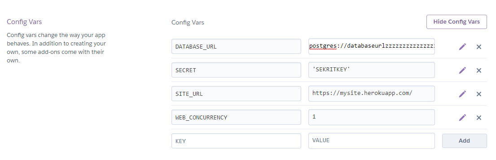

# Secondary Structure Prediction Display - Browser Version
An application that sends a protein sequence to various websites to generate predictions. The results are then scraped and saved into a database that is accessed for display.

Setting Up
-----------
This application requires a token.pickle and credentials.json in the [services](services) folder. 

**credentials.json** can be made by creating a project on the [Google Cloud Platform](https://console.cloud.google.com/). This application only uses the Gmail API.

**token.pickle** can be created by running the createPickle function found in [services/emailtools.py](emailtools.py#L64) and logging into a Google account.

A database is required to run this application. The url can be set in [app.py](app.py#L17) with the `DATABASE_URL` variable. Details about the table can be seen in [maketable.py](services/maketable.py).

Hosting on Heroku
-----------
To deploy on Heroku, a database must be created by going to the **Deploy** tab and entering **Heroku Postgres** into the **Add-ons** bar. Select a plan (default is Hobby Dev) and then proceed by clicking **Provision**. This will automatically generate a `DATABASE_URL`.

Create the table by pushing the application onto Heroku.

In the Settings tab, select **Reveal Config Vars**. 

Create a key named `SECRET` and give it any value.

Create a key named `WEB_CONCURRENCY` and give it the value `1`.

Create a key named `SITE_URL` and give it the value of the Heroku website's URL.


Finally, ensure that **credentials.json** and **token.pickle** are in the services folder. Delete [.gitignore](.gitignore) or remove all text so that the files will be able to be pushed onto Heroku.

Dependencies
-----------
```
beautifulsoup4 lxml urllib3 Flask wtforms Flask-WTF psycopg2-binary --upgrade google-api-python-client google-auth-httplib2 google-auth-oauthlib python-guerrillamail
```